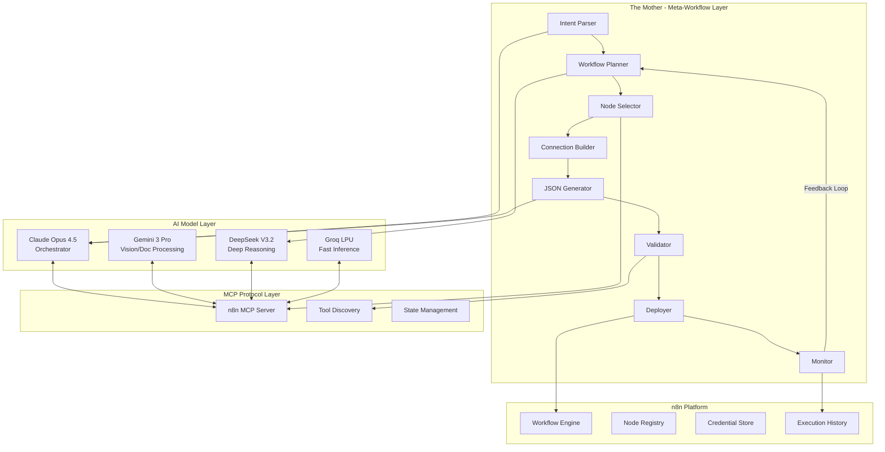

# Research Document: The Mother of All Workflows
## AI-Powered Meta-Workflow Generation with Frontier Models & MCP Integration

**Date:** December 26, 2025
**Research Period:** November 1, 2025 - December 26, 2025 (8 weeks)
**Author:** Research conducted via Claude Opus 4.5
**Classification:** Strategic Technical Research

---

## Executive Summary

This document synthesizes the latest innovations in AI workflow orchestration, focusing on the convergence of **frontier language models** (Claude Opus 4.5, Gemini 3 Pro, DeepSeek V3.2-Speciale), **inference acceleration** (Groq LPU), **protocol standardization** (MCP), and **n8n's evolving AI capabilities**. The research validates the technical feasibility of building "The Mother"—a meta-workflow system capable of generating, orchestrating, and managing child workflows autonomously.

### Key Findings

| Capability | Status (Dec 2025) | Enabler |
|------------|-------------------|---------|
| AI-generated workflow JSON | **Production Ready** | n8n AI Workflow Builder, MCP servers |
| Multi-model orchestration | **Production Ready** | MCP standardization across vendors |
| Sub-second reasoning loops | **Production Ready** | Groq LPU (7.4x faster inference) |
| Cost-effective deep reasoning | **Production Ready** | DeepSeek V3.2 ($0.028/M tokens) |
| Secure secrets for agents | **Production Ready** | VarLock @env-spec schema |
| Workflow-as-tool pattern | **Production Ready** | n8n ToolWorkflow v2.2 |
| Agentic code execution in sandbox | **Production Ready** | Claude Code sandboxing, MCP code execution |

---

## Table of Contents

1. [The "Mother" Concept: Technical Architecture](#1-the-mother-concept-technical-architecture)
2. [Frontier Model Capabilities (December 2025)](#2-frontier-model-capabilities-december-2025)
3. [n8n MCP Integration Deep Dive](#3-n8n-mcp-integration-deep-dive)
4. [VarLock: Secure Environment Variable Management](#4-varlock-secure-environment-variable-management)
5. [What's Now Possible That Wasn't Before](#5-whats-now-possible-that-wasnt-before)
6. [High-Leverage Questions & Answers](#6-high-leverage-questions--answers)
7. [Implementation Roadmap](#7-implementation-roadmap)
8. [Sources & References](#8-sources--references)

---

## 1. The "Mother" Concept: Technical Architecture

### 1.1 Definition

"The Mother" is a **meta-workflow architecture**—a workflow that generates, orchestrates, monitors, and evolves other workflows based on high-level intent. Rather than manually constructing automation pipelines, users describe desired outcomes, and The Mother:

1. **Analyzes** the requirement and decomposes it into sub-tasks
2. **Generates** n8n workflow JSON conforming to the schema
3. **Validates** the generated workflow against available nodes and connections
4. **Deploys** the workflow via n8n API
5. **Monitors** execution and iterates on failures
6. **Evolves** workflows based on performance metrics

### 1.2 Architectural Diagram



### 1.3 n8n Workflow JSON Schema

Based on codebase analysis, the workflow schema structure:

```typescript
interface WorkflowDefinition {
  name: string;
  active: boolean;
  nodes: INode[];
  connections: IConnections;
  settings?: IWorkflowSettings;
  staticData?: IDataObject;
  pinData?: IPinData;
  tags?: Array<{ name: string; id?: string }>;
}

interface INode {
  id: string;                    // UUID
  name: string;                  // Display name (unique per workflow)
  type: string;                  // e.g., "@n8n/n8n-nodes-langchain.agent"
  typeVersion: number;           // Node version
  position: [number, number];    // Canvas coordinates
  parameters: INodeParameters;   // Node-specific config
  credentials?: INodeCredentials;
}

interface IConnections {
  [sourceNodeName: string]: {
    [connectionType: string]: Array<Array<{
      node: string;              // Target node name
      type: NodeConnectionType;  // 'main', 'ai_tool', etc.
      index: number;             // Output/input index
    }>>;
  };
}
```

### 1.4 Key Connection Types for AI Workflows

| Connection Type | Purpose | Example Nodes |
|-----------------|---------|---------------|
| `main` | Standard data flow | All trigger/action nodes |
| `ai_agent` | Agent orchestration | Agent → Sub-agent |
| `ai_tool` | Tool provision | ToolWorkflow → Agent |
| `ai_languageModel` | LLM connection | ChatOpenAI → Agent |
| `ai_memory` | Conversation memory | BufferMemory → Agent |
| `ai_vectorStore` | RAG retrieval | Pinecone → Retriever |

---

## 2. Frontier Model Capabilities (December 2025)

### 2.1 Claude Opus 4.5

**Release:** Late 2025
**Pricing:** $5/M input, $25/M output tokens

#### Breakthrough Features

| Feature | Description | Impact on Meta-Workflows |
|---------|-------------|--------------------------|
| **Programmatic Tool Calling** | Claude writes code that calls tools within a sandbox, avoiding round-trips | 10x reduction in latency for multi-tool operations |
| **Tool Search** | Dynamic tool discovery from 100s of tools | Enables massive tool libraries without context bloat |
| **Tool Use Examples** | Sample tool calls in definitions | Higher accuracy for complex schemas |
| **Effort Parameter** | Control reasoning depth | Cost optimization for simple vs complex generations |
| **Sub-agents** | Specialized task delegation | Solves "context pollution" problem |

#### Performance Benchmarks
- **SWE-bench Verified:** 80.9% (industry leading)
- **OSWorld (computer use):** 66.3%
- **Tool calling errors:** 50-75% reduction vs previous versions

**Source:** [Anthropic Claude Opus 4.5](https://www.anthropic.com/claude/opus), [What's New in Claude 4.5](https://platform.claude.com/docs/en/about-claude/models/whats-new-claude-4-5)

### 2.2 Gemini 3 Pro

**Release:** November 2025 (Preview), Full stable expected Dec 2025
**Context Window:** 1M tokens

#### Breakthrough Features

| Feature | Description | Impact on Meta-Workflows |
|---------|-------------|--------------------------|
| **Spatial Reasoning** | True visual and spatial understanding | Workflow generation from screenshots/diagrams |
| **High-Frame Video** | 10 FPS video analysis | Process video tutorials → workflows |
| **Multimodal Functions** | Images/PDFs in function responses | Rich documentation in tool outputs |
| **Document Understanding** | State-of-the-art on MMMU Pro | Parse complex specs → workflow requirements |

#### Key Insight for The Mother
Gemini 3 Pro can analyze:
- Existing workflow screenshots → extract patterns
- Video demonstrations → convert to automation steps
- PDF documentation → generate integration workflows

**Source:** [Google Gemini 3](https://blog.google/products/gemini/gemini-3/), [Gemini 3 Pro Vision](https://blog.google/technology/developers/gemini-3-pro-vision/)

### 2.3 DeepSeek V3.2 & V3.2-Speciale

**Release:** December 4, 2025
**License:** MIT (fully open source)
**Parameters:** 671B total, 37B active (MoE)

#### Breakthrough Features

| Feature | Description | Impact on Meta-Workflows |
|---------|-------------|--------------------------|
| **Cost Efficiency** | $0.028/M input tokens (10x cheaper than GPT-5) | Economically viable deep reasoning |
| **Open Weights** | Full model on Hugging Face | Self-hosted deployment possible |
| **Gold-Medal Reasoning** | IMO Gold (35/42), IOI Gold (492/600) | Complex workflow logic generation |
| **MIT License** | No restrictions | Enterprise-safe deployment |

#### Speciale Variant
- Designed exclusively for deep reasoning tasks
- Does NOT support tool-calling (pure reasoning)
- Best for: Planning phases, complex logic design, validation

**Strategic Use:** Use DeepSeek V3.2-Speciale for workflow planning/design phase, then hand off to Claude Opus 4.5 for execution with tools.

**Source:** [DeepSeek V3.2 on Hugging Face](https://huggingface.co/deepseek-ai/DeepSeek-V3.2), [VentureBeat Coverage](https://venturebeat.com/ai/deepseek-just-dropped-two-insanely-powerful-ai-models-that-rival-gpt-5-and)

### 2.4 Groq Cloud LPU

**Major News:** Nvidia acquired Groq for $20B (December 24, 2025)

#### Performance Metrics

| Metric | Value | Comparison |
|--------|-------|------------|
| Inference Speed | 5x+ faster than GPU | Enables real-time agentic loops |
| Latency Reduction | Sub-100ms responses | Interactive workflow generation |
| Cost Reduction | 89% cheaper (reported) | Production-viable at scale |
| Energy Efficiency | 10x vs GPU | Sustainable scaling |

#### Llama 3.3 70B with Speculative Decoding
6x speed boost on Groq's first-gen 14nm chip using speculative decoding.

**Strategic Use for The Mother:**
- Fast validation loops (generate → validate → fix → repeat)
- Real-time user feedback during workflow creation
- High-frequency monitoring of child workflow execution

**Source:** [Groq Official](https://groq.com/), [Nvidia-Groq Deal](https://www.techbuzz.ai/articles/nvidia-snaps-up-groq-in-record-20b-ai-chip-acquisition)

---

## 3. n8n MCP Integration Deep Dive

### 3.1 Current MCP Architecture in n8n

n8n implements MCP through two native nodes:

#### MCP Client Tool (`McpClientTool.node.ts`)
- **Purpose:** Connect to external MCP servers
- **Transport:** Server-Sent Events (SSE)
- **Authentication:** Bearer Auth, Header Auth
- **Tool Discovery:** Dynamic listing from remote servers

```typescript
// Simplified flow
const client = await connectMcpClient({ sseEndpoint, headers });
const allTools = await getAllTools(client);
const tools = allTools.map(tool =>
  mcpToolToDynamicTool(tool, createCallTool(tool.name, client))
);
return { response: new McpToolkit(tools) };
```

#### MCP Server Trigger (`McpTrigger.node.ts`)
- **Purpose:** Expose n8n workflows as MCP tools
- **Transports:** SSE + Streamable HTTP (v2.0)
- **Use Case:** Let external AI assistants call n8n workflows

### 3.2 n8n-MCP Server Ecosystem

| Server | Capabilities | Nodes Covered |
|--------|--------------|---------------|
| [n8n-mcp (czlonkowski)](https://github.com/czlonkowski/n8n-mcp) | Workflow building for Claude | Full workflow generation |
| [n8n MCP Server (illuminaresolutions)](https://glama.ai/mcp/servers/@illuminaresolutions/n8n-mcp-server) | Documentation access | 543 nodes, 99% property coverage |
| [n8n Workflow Builder](https://github.com/makafeli/n8n-workflow-builder) | AI-assisted management | CRUD + execution |

### 3.3 Key MCP Capabilities for The Mother

1. **Tool Discovery:** The Mother can query available n8n nodes via MCP
2. **Dynamic Tool Loading:** Only load relevant tools per workflow generation
3. **Validation Feedback:** MCP servers provide real-time schema validation
4. **Execution Bridging:** Generated workflows can be deployed via MCP
5. **Documentation Sync:** Latest node docs available within 48 hours of release

### 3.4 MCP Code Execution Pattern

From Anthropic's engineering blog:
> "Agents scale better by writing code to call tools instead of direct tool calls that consume context for each definition and result."

**Implication:** The Mother can generate Python/JS code that orchestrates multiple n8n API calls, rather than making individual tool calls.

**Source:** [n8n MCP Docs](https://n8n.io/integrations/categories/ai/model-context-protocol/), [Anthropic MCP Code Execution](https://www.anthropic.com/engineering/code-execution-with-mcp)

---

## 4. VarLock: Secure Environment Variable Management

### 4.1 Overview

VarLock provides schema-driven environment variable management through the `@env-spec` declarative language. It transforms `.env` files into type-safe, validated, and secure configuration systems.

**Repository:** [github.com/dmno-dev/varlock](https://github.com/dmno-dev/varlock)

### 4.2 Core Features

| Feature | Description | Relevance to AI Workflows |
|---------|-------------|---------------------------|
| **Type Validation** | Enum, port, URL, string patterns | Validate API keys, endpoints |
| **Sensitive Marking** | `@sensitive` decorator | Auto-redact in logs, prevent leaks |
| **Variable Expansion** | `${VAR_NAME}` syntax | Compose complex configs |
| **Schema in VCS** | `.env.schema` versioned | Team sync, drift prevention |
| **1Password Integration** | `exec()` for external secrets | Enterprise secret management |

### 4.3 Schema Format Example

```bash
# .env.schema

# @description=The execution environment
# @type=enum(development, preview, production)
# @required
NODE_ENV=

# @description=OpenAI API key for workflow generation
# @type=string(startsWith=sk-)
# @required @sensitive
OPENAI_API_KEY=

# @description=n8n instance URL
# @type=url
# @required
N8N_BASE_URL=

# @description=n8n API key
# @type=string(minLength=32)
# @required @sensitive
N8N_API_KEY=

# @description=Groq API key for fast inference
# @type=string(startsWith=gsk_)
# @sensitive
GROQ_API_KEY=
```

### 4.4 GitHub Actions Integration

```yaml
- name: Load and validate environment
  uses: dmno-dev/varlock-action@v1
  with:
    schema-file: .env.schema

# Sensitive values → GitHub secrets (masked)
# Non-sensitive values → Environment variables
```

### 4.5 Why VarLock Matters for The Mother

1. **LLM-Safe Secrets:** Prevents accidental exposure of API keys in prompts
2. **Multi-Environment:** Easy switching between dev/staging/prod n8n instances
3. **Type Safety:** Validates all AI model API keys before workflow execution
4. **Audit Trail:** Schema changes tracked in git
5. **CI/CD Integration:** Automatic validation in deployment pipelines

**Source:** [VarLock Documentation](https://varlock.dev/), [VarLock GitHub](https://github.com/dmno-dev/varlock)

---

## 5. What's Now Possible That Wasn't Before

### 5.1 Capability Timeline

| Capability | Before (Oct 2025) | After (Dec 2025) | Enabler |
|------------|-------------------|------------------|---------|
| **Workflow from natural language** | Partial, error-prone | Production-ready | n8n AI Workflow Builder + LangGraph |
| **Multi-model orchestration** | Manual API switching | Unified MCP protocol | MCP adoption by OpenAI, Google, Anthropic |
| **Real-time workflow iteration** | 5-10s latency | <500ms | Groq LPU |
| **Cost-effective deep reasoning** | $0.30/M tokens | $0.028/M tokens | DeepSeek V3.2 |
| **Vision-to-workflow** | Not possible | Analyze screenshots/videos | Gemini 3 Pro spatial reasoning |
| **Secure agent credentials** | Ad-hoc management | Schema-validated | VarLock @env-spec |
| **Tool libraries at scale** | 10-20 tools max | 100s of tools | Claude Tool Search |
| **Sandboxed code execution** | External setup required | Native in Claude Code | Anthropic sandboxing update |

### 5.2 Breakthrough Combinations

#### Combination 1: Vision → Workflow Pipeline
```
Gemini 3 Pro (analyze video/screenshot)
    ↓
DeepSeek V3.2-Speciale (plan workflow logic)
    ↓
Claude Opus 4.5 (generate JSON + validate)
    ↓
n8n MCP Server (deploy)
```

#### Combination 2: Ultra-Fast Iteration Loop
```
User Intent → Groq (fast parse) → Claude (generate) → Groq (validate) → Deploy
                                       ↑__________________|
                                         (fix errors)
```

#### Combination 3: Self-Improving Workflows
```
Monitor execution metrics
    ↓
DeepSeek (analyze failures, reason about fixes)
    ↓
Claude (implement changes)
    ↓
Redeploy via MCP
    ↓
Continue monitoring
```

### 5.3 The "Agentic Era" Context

2025 is officially the **Agentic Era** in software development:
- Movement from IDE chatbots to agentic CLIs
- Claude Code introduced sub-agents for specialized tasks
- Anthropic announced **Agent Skills** as an open standard
- "Parallel runner" pattern emerged (Conductor, Verdent)

**Source:** [The New Stack - Agentic CLI Era](https://thenewstack.io/ai-coding-tools-in-2025-welcome-to-the-agentic-cli-era/), [Simon Willison on Agentic Coding](https://simonwillison.net/2025/Jun/29/agentic-coding/)

---

## 6. High-Leverage Questions & Answers

### Q1: What is the current state of n8n's native AI capabilities, and how does MCP change the integration paradigm?

**Answer:**

n8n's AI architecture is built on LangChain abstractions with these key components:

1. **Agent Node (v2):** ToolsAgent pattern with streaming support
2. **Tool Nodes:** ToolWorkflow, ToolHttpRequest, ToolCode, ToolVectorStore
3. **MCP Nodes:** McpClientTool (consume), McpTrigger (expose)

**Paradigm Shift with MCP:**

| Before MCP | After MCP |
|------------|-----------|
| n8n calls AI APIs | AI agents call n8n as a tool |
| Static tool definitions | Dynamic tool discovery |
| Single-model workflows | Multi-model orchestration |
| Manual credential setup | Unified auth via MCP headers |

The `supplyData` pattern in n8n allows lazy tool instantiation, enabling efficient resource management for large tool libraries.

### Q2: What state management and context persistence patterns exist for long-running agentic workflows?

**Answer:**

**LangGraph (n8n's enterprise AI Workflow Builder):**
- Graph-based state machine architecture
- Built-in checkpointing and memory persistence
- Human-in-the-loop interrupts at any node

**n8n Native:**
- `Wait` and `Form` nodes for pause/resume
- `staticData` field for workflow-level persistence
- Execution history for replay and debugging

**For The Mother specifically:**
- Use LangGraph StateGraph for orchestration layer
- Persist workflow generation state in n8n variables (Enterprise)
- Implement checkpoint pattern: save state before each generation phase

### Q3: How do current frontier models handle structured output generation for workflow definition schemas?

**Answer:**

| Model | Structured Output Support | Reliability |
|-------|--------------------------|-------------|
| Claude Opus 4.5 | Tool use with Zod schemas, Tool Use Examples | Excellent (50-75% fewer errors) |
| Gemini 3 Pro | JSON mode, function calling | Very Good |
| DeepSeek V3.2 | JSON mode, no native tool calling | Good for planning, not execution |
| GPT-5 | Structured outputs, function calling | Excellent |

**Best Practice for The Mother:**
1. Define n8n workflow schema as Zod types
2. Use Claude Opus 4.5 with Tool Use Examples showing valid workflows
3. Validate output against n8n's node registry
4. Use Groq for fast validation loops

### Q4: What are the security implications of autonomous workflow generation?

**Answer:**

**Risks:**
- Generated workflows could access unintended credentials
- Malicious prompts could create data exfiltration workflows
- Runaway execution costs from generated loops

**Mitigation Patterns:**
1. **Credential Allowlisting:** Only permit specific credential types per generation context
2. **Node Allowlisting:** Restrict which nodes can be used in generated workflows
3. **Human-in-the-Loop:** Require approval before activation
4. **Execution Sandboxing:** Run generated workflows in isolated environment first
5. **Cost Limits:** Set execution budgets per generated workflow
6. **VarLock Integration:** Ensure no secrets leak into prompts

**Claude Code Approach:**
- Filesystem and network sandboxing by default
- "Zero trust" in Agent SDK—all tools blocked unless explicitly allowed

### Q5: What is the latency/cost profile of multi-step agentic reasoning?

**Answer:**

**Current Benchmarks (December 2025):**

| Model | Latency (simple task) | Latency (complex task) | Cost/1M tokens |
|-------|----------------------|------------------------|----------------|
| Claude Opus 4.5 | 2-5s | 10-30s | $5 in / $25 out |
| Gemini 3 Pro | 1-3s | 5-15s | ~$3.50 in / $10.50 out |
| DeepSeek V3.2 | 3-8s | 15-60s | $0.028 in / $0.14 out |
| Groq (Llama 3.3 70B) | 0.1-0.5s | 1-3s | ~$0.05-0.10 |

**Optimal Pipeline for The Mother:**

1. **Fast Triage (Groq):** Parse intent, route to appropriate model - 100ms
2. **Planning (DeepSeek):** Deep reasoning on workflow structure - 10-20s, $0.01
3. **Generation (Claude):** Produce validated JSON with tools - 5-10s, $0.15
4. **Validation (Groq):** Quick schema check - 200ms
5. **Total:** ~20-30s, ~$0.20 per workflow

**Economic Viability:** At $0.20/workflow generation, producing 1000 workflows/month costs ~$200.

---

## 7. Implementation Roadmap

### Phase 1: Foundation (Weeks 1-2)
- [ ] Set up VarLock schema for all AI provider credentials
- [ ] Deploy n8n MCP Server for workflow management
- [ ] Create workflow JSON validation tool using Zod schemas
- [ ] Build intent parser using Groq for fast routing

### Phase 2: Core Generation (Weeks 3-4)
- [ ] Implement workflow planner using DeepSeek V3.2
- [ ] Build node selector with n8n-mcp documentation server
- [ ] Create JSON generator using Claude Opus 4.5 with Tool Use Examples
- [ ] Implement validation loop with Groq

### Phase 3: Deployment & Monitoring (Weeks 5-6)
- [ ] Build deployer using n8n API via MCP
- [ ] Implement execution monitor
- [ ] Create feedback loop for self-improvement
- [ ] Add human-in-the-loop approval gates

### Phase 4: Advanced Features (Weeks 7-8)
- [ ] Vision-to-workflow using Gemini 3 Pro
- [ ] Multi-workflow orchestration
- [ ] Performance optimization and caching
- [ ] Production hardening and security audit

---

## 8. Sources & References

### Frontier Models
- [Anthropic Claude Opus 4.5](https://www.anthropic.com/claude/opus)
- [What's New in Claude 4.5](https://platform.claude.com/docs/en/about-claude/models/whats-new-claude-4-5)
- [Claude Opus 4.5 on AWS Bedrock](https://aws.amazon.com/blogs/machine-learning/claude-opus-4-5-now-in-amazon-bedrock/)
- [Google Gemini 3](https://blog.google/products/gemini/gemini-3/)
- [Gemini 3 Pro Vision](https://blog.google/technology/developers/gemini-3-pro-vision/)
- [DeepSeek V3.2 on Hugging Face](https://huggingface.co/deepseek-ai/DeepSeek-V3.2)
- [DeepSeek V3.2-Speciale](https://huggingface.co/deepseek-ai/DeepSeek-V3.2-Speciale)
- [DeepSeek API Docs](https://api-docs.deepseek.com/news/news251201)

### Groq & Inference
- [Groq Official](https://groq.com/)
- [Groq LPU Explained](https://groq.com/blog/the-groq-lpu-explained)
- [Nvidia-Groq Acquisition](https://www.techbuzz.ai/articles/nvidia-snaps-up-groq-in-record-20b-ai-chip-acquisition)

### n8n & MCP
- [n8n MCP Integration](https://n8n.io/integrations/categories/ai/model-context-protocol/)
- [n8n AI Workflow Builder Docs](https://docs.n8n.io/advanced-ai/ai-workflow-builder/)
- [n8n-mcp GitHub](https://github.com/czlonkowski/n8n-mcp)
- [n8n Workflow Builder MCP](https://github.com/makafeli/n8n-workflow-builder)
- [MCP Community Feature Request](https://community.n8n.io/t/provide-and-use-model-context-protocol/63799)

### MCP & Agentic Development
- [Anthropic MCP Announcement](https://www.anthropic.com/news/model-context-protocol)
- [MCP Code Execution](https://www.anthropic.com/engineering/code-execution-with-mcp)
- [Claude Agent SDK MCP Docs](https://docs.claude.com/en/docs/agent-sdk/mcp)
- [12 MCP Framework Comparison](https://clickhouse.com/blog/how-to-build-ai-agents-mcp-12-frameworks)

### VarLock
- [VarLock GitHub](https://github.com/dmno-dev/varlock)
- [VarLock Documentation](https://varlock.dev/)
- [VarLock GitHub Actions](https://varlock.dev/integrations/github-action/)
- [VarLock Schema Guide](https://varlock.dev/guides/schema/)

### Agentic Development Trends
- [The New Stack - Agentic CLI Era](https://thenewstack.io/ai-coding-tools-in-2025-welcome-to-the-agentic-cli-era/)
- [AI Engineering Trends 2025](https://thenewstack.io/ai-engineering-trends-in-2025-agents-mcp-and-vibe-coding/)
- [Simon Willison on Agentic Coding](https://simonwillison.net/2025/Jun/29/agentic-coding/)
- [LangGraph vs n8n Comparison](https://www.zenml.io/blog/langgraph-vs-n8n)

---

## Appendix A: n8n Node Connection Types

```typescript
const NodeConnectionTypes = {
  Main: 'main',
  AiAgent: 'ai_agent',
  AiTool: 'ai_tool',
  AiLanguageModel: 'ai_languageModel',
  AiChain: 'ai_chain',
  AiOutputParser: 'ai_outputParser',
  AiMemory: 'ai_memory',
  AiEmbedding: 'ai_embedding',
  AiRetriever: 'ai_retriever',
  AiDocument: 'ai_document',
  AiVectorStore: 'ai_vectorStore',
  AiTextSplitter: 'ai_textSplitter',
  AiReranker: 'ai_reranker',
} as const;
```

## Appendix B: Sample Meta-Workflow Prompt Template

```markdown
# Workflow Generation Request

## Intent
{user_intent}

## Available Nodes
{node_list_from_mcp}

## Available Credentials
{credential_types_allowlisted}

## Constraints
- Maximum nodes: 20
- Must include error handling
- Must log execution to {monitoring_endpoint}

## Output Format
Provide valid n8n workflow JSON conforming to the IWorkflowDb interface.
Include:
1. All required node properties
2. Proper connection definitions
3. Credential references (not values)
4. Position coordinates for canvas layout

## Validation Requirements
- All node types must exist in available nodes list
- All connections must use valid connection types
- All required parameters must be provided
```

---

*Document generated: December 26, 2025*
*Research methodology: Web search, codebase analysis, documentation review*
*Next update scheduled: January 9, 2026*
